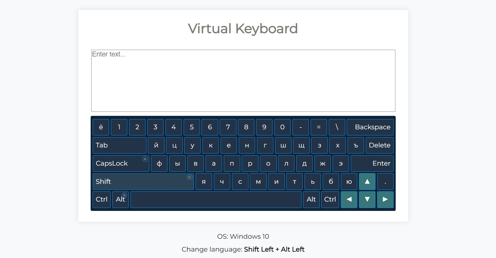

# App "Virtual Keyboard"

Deploy: [https://nata-kostina.github.io/app-virtual-keyboard/dist/](https://nata-kostina.github.io/app-virtual-keyboard/dist/ "Virtual Keyboard")
***
## Description

The app imitates the functionality of a real keyboard. The user can either click buttons on the screen or press keys on the real keyboard. The app highlights the pressed or clicked buttons and display the result on the screen.

Features:

* generation of DOM elements
* highlighting the keys on the virtual keyboard
* switching keyboard layouts between English and Russion languages
* animation of pressing a key
* usage of ES6+ features (classes, property destructuring, etc)
* usage of ESLint

## Specification

[https://github.com/rolling-scopes-school/tasks/blob/master/tasks/virtual-keyboard/virtual-keyboard-en.md](https://github.com/rolling-scopes-school/tasks/blob/master/tasks/virtual-keyboard/virtual-keyboard-en.md "Spec")

## Screenshots

## Developed With
* HTML
* CSS
* SASS
* JavaScript
* IDE:  Visual Studio Code
* OS: Microsoft Windows 10